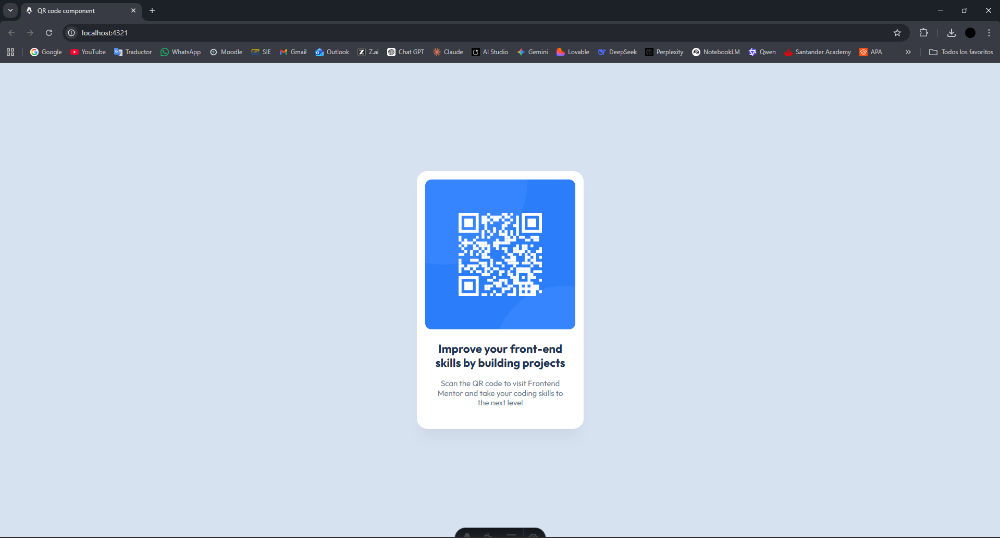

# 🧩 Proyecto: Componente QR Code

Este proyecto consiste en el desarrollo de un **componente de Código QR** utilizando **Astro** y **Tailwind CSS**.  
El objetivo es aplicar los conocimientos sobre **componentes**, **maquetación**, **estilos responsivos** y **utilidades CSS** para construir un diseño limpio, moderno y adaptable a diferentes dispositivos.

---

## 📖 Descripción general

### 🧩 Vista previa del proyecto
Ñ

---

### 🔗 Enlaces del proyecto

- **Repositorio en GitHub:** [https://github.com/CesarAlvizo/qr-code-component.git](https://github.com/CesarAlvizo/qr-code-component.git)
- **Sitio desplegado (opcional):** [https://qr-code-component-psi-pink.vercel.app/](https://qr-code-component-psi-pink.vercel.app/)

---

## 🧠 Proceso de desarrollo

### 🛠️ Tecnologías utilizadas
- [Astro](https://astro.build)
- [Tailwind CSS](https://tailwindcss.com/)
- HTML5 semántico
- Diseño responsivo (Mobile-first)
- Componentes reutilizables

---

### 💡 Lo que aprendí
Utilizar estilos de tailwind y organizar mejor el proyecto.

---

### 🚀 Áreas de mejora

Practicar y comprender mejor el uso de Tailwind CSS para optimizar estilos.

Separar el componente en archivos independientes para mejorar la organización del proyecto.

### 📚 Recursos útiles
- [Documentación de Astro](https://docs.astro.build)  
- [Guía oficial de Tailwind CSS](https://tailwindcss.com/docs)  
- [MDN Web Docs - HTML y CSS](https://developer.mozilla.org/es/)  
- [Guía de diseño responsivo](https://web.dev/responsive-web-design-basics/)  

### 👩‍💻 Autor

- **Nombre completo: César Isaac Alvizo Esquivel**  
- **Carrera: Ingenieria en tecnologias de la informacion y comunciaciones**  
- **Grupo: 6°**  
- **Correo institucional: 23151214**  

---

### ✨ Reflexión final

Durante el desarrollo de este proyecto fue sencillo crear la estructura básica usando HTML y Astro.
Este proyecto me ayudó a entender mejor cómo funciona Astro y cómo usar Tailwind CSS para crear interfaces limpias y responsivas.